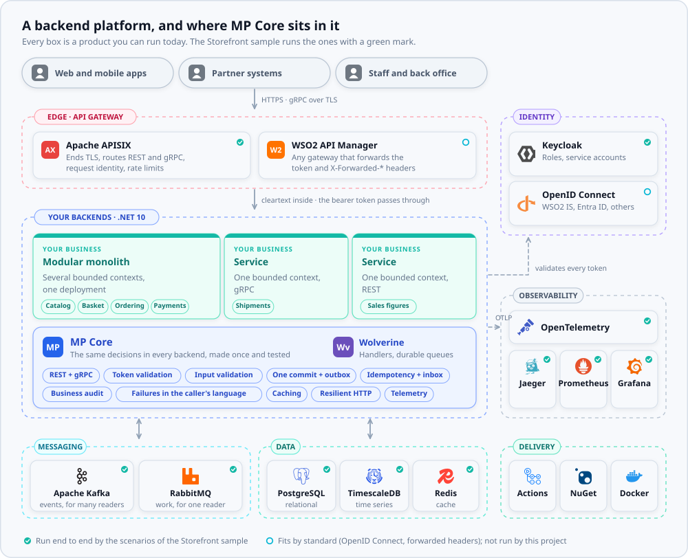
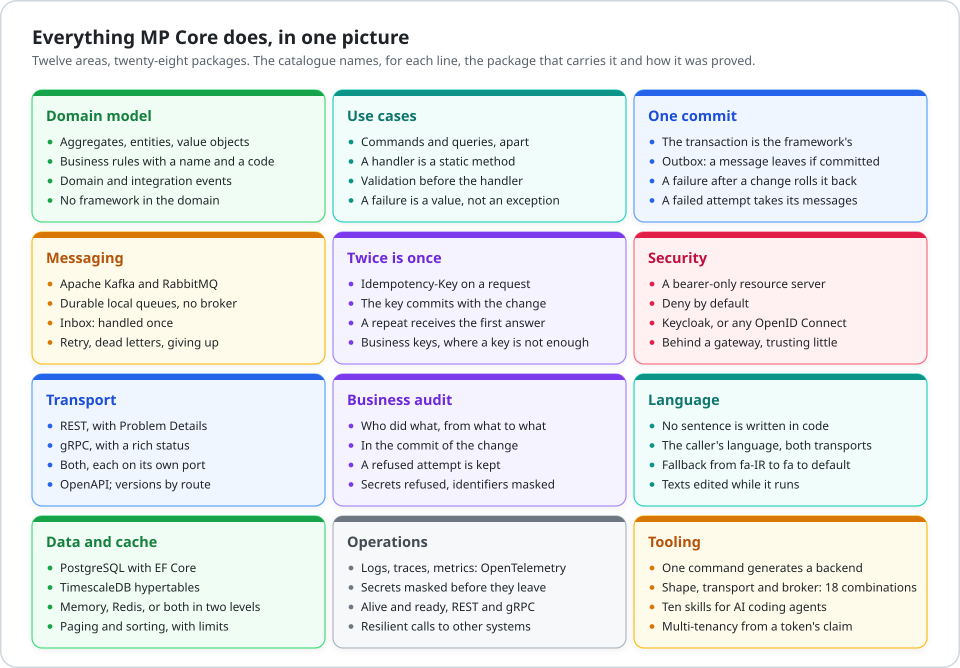
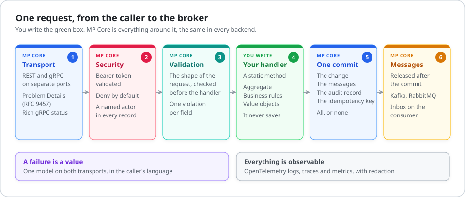
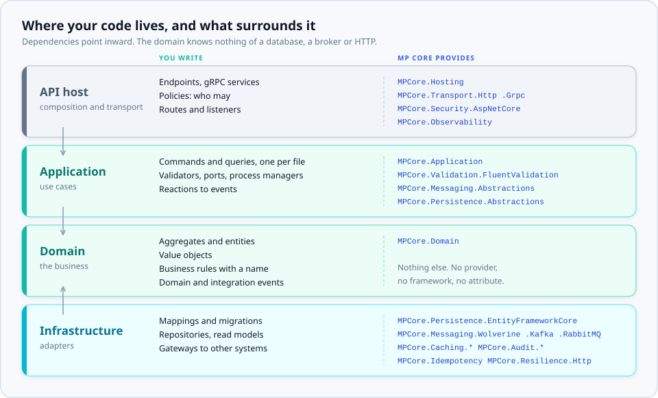
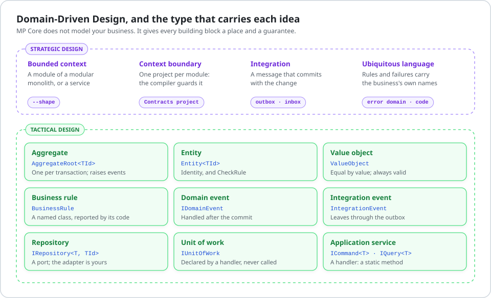
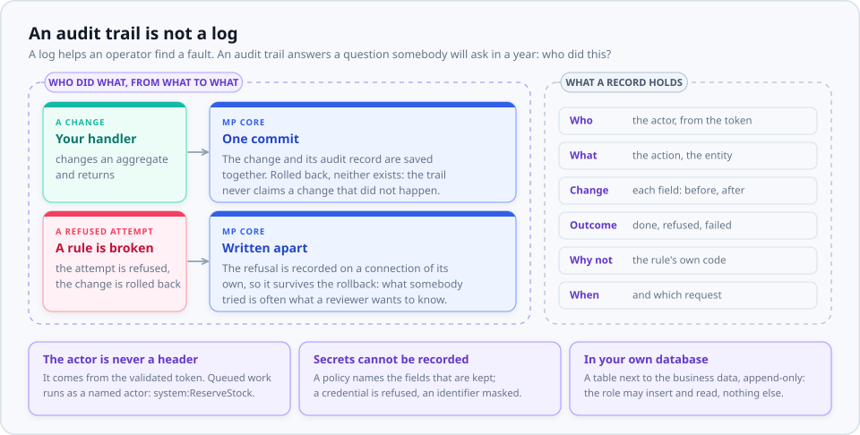
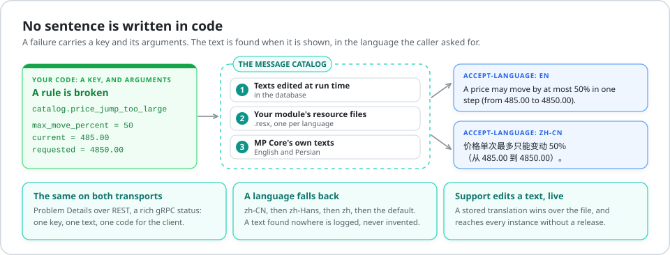
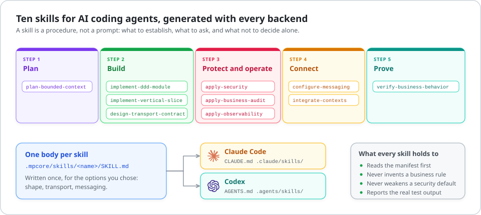

<div align="center">

# MP Core

**The backend architecture you would have built anyway: already built, tested, and explained.**

A framework for .NET 10 that makes the decisions every backend makes again,<br>
once, in the open, with a test for each and the name of the person who first described it.

[](https://www.nuget.org/profiles/panahister)
[](https://github.com/panahister/mpcore/actions/workflows/ci.yml)
[](LICENSE)
[](global.json)

[Get started](docs/guide/getting-started.md) ·
[Capabilities](docs/guide/capabilities.md) ·
[Reference architecture](docs/architecture/reference-architecture.md) ·
[AI agents](#built-for-ai-coding-agents) ·
[The sample](https://github.com/panahister/mpcore-storefront-sample) ·
[Decisions](docs/decisions) ·
[Release notes](docs/releases/0.9.0.md)

</div>

<picture>
  <source media="(prefers-color-scheme: dark)" srcset="docs/images/reference-architecture-dark.svg">
  
</picture>

## Why MP Core

A backend is mostly decisions that have nothing to do with its business. Who opens the transaction, and
who commits it? Does a message leave when the change it announces was rolled back? What does a caller see
when a rule is broken, and does it look the same over REST and over gRPC? What happens when the same
request arrives twice?

Every team answers these, every time, under a deadline. The answers differ from service to service, and
the ones that are wrong stay hidden until production finds them.

| The pain | What usually happens | With MP Core |
|---|---|---|
| **A message is sent, and the change it announces is lost**, or the other way round | Publish, then save, and hope | The change, its messages, the audit record and the idempotency key are **one commit**. A message leaves if, and only if, the change was committed |
| **A client retries a request** after a timeout, and the customer is charged twice | Each endpoint invents its own guard, or has none | `RequireIdempotencyKey()`: a repeat receives the first answer, and nothing happens twice |
| **A broker delivers a message twice** | Every consumer is written to be careful, and one is not | An inbox in the consumer's own transaction stops the second delivery before the handler |
| **Every service reports failure in its own way** | Status codes, strings, exceptions that leak a stack trace | One failure model. REST answers Problem Details (RFC 9457), gRPC a rich status, both in the caller's language |
| **Business rules are scattered** over controllers, handlers and the database | Nobody can list the rules of the system | A rule is a class with a name, checked by the aggregate, reported under its own code |
| **Security is added at the end** | One endpoint is forgotten | Deny by default. An endpoint without a policy requires a token, and identity comes from the token only |
| **Nobody can see what happened** | Logs in one place, traces nowhere | OpenTelemetry logs, traces and metrics from the first request, with secrets redacted |
| **An AI agent writes code that compiles and breaks the architecture** | Review catches some of it | Ten skills ship with every backend and tell the agent what to establish, what to ask, and what it may not decide alone |

**You write the business. MP Core is everything around it**, the same in every backend, so that the second
service a team builds is as sound as the first.

## Everything it does

<picture>
  <source media="(prefers-color-scheme: dark)" srcset="docs/images/capabilities-dark.svg">
  
</picture>

[**The catalogue of capabilities**](docs/guide/capabilities.md) has every line of this picture, with the
package that carries it and how it was proved: by a test of this repository, or by a scenario of the
sample that runs against live backends. It ends with what MP Core deliberately **does not** do, because a
framework that says yes to everything guarantees nothing.

## Start in two minutes

```bash
dotnet tool install --global MPCore.Cli --version 0.9.0
```

```bash
dotnet new install MPCore.Templates::0.9.0
```

```bash
mpcore new backend --organization Acme --component Orders --output ./orders --shape modular-monolith --transport both --messaging kafka --cache hybrid --business-audit postgresql
```

You get a backend that builds, starts, protects every endpoint, and carries its own guides and skills,
written for the options you chose. [Getting started](docs/guide/getting-started.md) takes you from there
to a first use case with a rule, an endpoint and a test.

| Choice | Values |
|---|---|
| `--shape` | `service`, `modular-monolith` |
| `--transport` | `rest`, `grpc`, `both` |
| `--messaging` | `kafka`, `rabbitmq`, `none` |
| `--cache` | `none`, `memory`, `redis`, `hybrid` |
| `--business-audit` | `none`, `postgresql` |
| `--timeseries` | `none`, `timescale` |
| `--ai-tooling` | `none`, `codex`, `claude`, `both` |

## The architecture

The picture at the top is the whole platform. [The reference architecture](docs/architecture/reference-architecture.md)
describes every part of it: what it is for, how MP Core works with it, and how far that was proved.

### One request, end to end

<picture>
  <source media="(prefers-color-scheme: dark)" srcset="docs/images/request-dark.svg">
  
</picture>

A handler is a static method. It takes a command and the ports it needs, changes an aggregate, and
returns. It never saves: MP Core saves after the handler returns, and releases the messages only after
the commit. [Concepts](docs/guide/concepts.md) explains each step and what is guaranteed when one fails.

### Inside one backend

<picture>
  <source media="(prefers-color-scheme: dark)" srcset="docs/images/layers-dark.svg">
  
</picture>

## Works with

MP Core relies on standards, not on products: OpenID Connect for identity, `X-Forwarded-*` for a gateway,
OTLP for telemetry. A product that speaks the standard fits. The table says which ones this project has
**run**, and which ones it has not.

| Part | Product | How MP Core works with it | Proved |
|---|---|---|---|
| API gateway | [Apache APISIX](https://apisix.apache.org) | TLS ends at the edge; REST and gRPC are routed to separate listeners; forwarded headers are believed from trusted proxies only; identity headers a caller could forge are removed | Run by the sample's scenarios |
| API gateway | [WSO2 API Manager](https://wso2.com/api-manager/), or another gateway | The same: it forwards the bearer token and the `X-Forwarded-*` headers | Fits by standard. Not run by this project |
| Identity | [Keycloak](https://www.keycloak.org) | A preset for realm roles, client roles and service accounts; one audience per backend | Run by the sample's scenarios |
| Identity | WSO2 Identity Server, Microsoft Entra ID, another OpenID Connect provider | A plain mapping of claims to roles, without a provider's name in the code | Fits by standard. Unit tests only |
| Messaging | [Apache Kafka](https://kafka.apache.org) | Integration events, partitioned by key; an outbox on the way out, an inbox on the way in | Run by the sample's scenarios |
| Messaging | [RabbitMQ](https://www.rabbitmq.com) | Work for one reader, on durable queues | Run by the sample's scenarios |
| Execution | [Wolverine](https://wolverinefx.net) | Handlers, middleware, durable local queues and the outbox | Run by the framework's own tests |
| Data | [PostgreSQL](https://www.postgresql.org) with Entity Framework Core | The unit of work, the outbox, the audit trail, idempotency and stored translations | Run by the framework's integration tests |
| Data | [TimescaleDB](https://www.timescale.com) | Hypertables, created in a migration | Run by the sample's scenarios |
| Cache | [Redis](https://redis.io) | A distributed cache, or the second level behind an in-process one | Run by the sample's scenarios |
| Telemetry | [OpenTelemetry](https://opentelemetry.io) with Jaeger, Prometheus and Grafana | Logs, traces and metrics over OTLP, each signal to its own destination | Run by the sample's scenarios |

## Domain-Driven Design

MP Core does not model your business, and holds none. It gives every building block of Domain-Driven
Design a place to live and a guarantee to rely on, so that the model you draw on a whiteboard is the model
in the code.

<picture>
  <source media="(prefers-color-scheme: dark)" srcset="docs/images/ddd-dark.svg">
  
</picture>

| When you decide | MP Core gives you |
|---|---|
| Where a bounded context ends | A module, which is one project the compiler guards, or a service. The same code moves from one to the other: between modules a message changes its transport and nothing else |
| How two contexts talk | A message that commits with the change, or a read-only interface in a `Contracts` project. A call that writes is possible, and is a recorded decision |
| What an aggregate protects | `CheckRule`: a rule is checked before the state changes, so an aggregate is never invalid |
| What a reader may ask | A query: its own message, no unit of work, a read model that returns views. It is the only thing a `GET` sends |

## An audit trail that can be trusted

A log helps an operator find a fault, and is thrown away after some weeks. An audit trail answers a
question somebody will ask in a year, perhaps a regulator: *who changed this, when, from what to what, and
who tried and was refused?* Most backends build it late, as log lines, and find out in the first review
that a log cannot answer it.

<picture>
  <source media="(prefers-color-scheme: dark)" srcset="docs/images/audit-dark.svg">
  
</picture>

| What a reviewer asks | How MP Core answers |
|---|---|
| Can the trail claim a change that did not happen? | No. The record is saved in the commit of the change it describes; rolled back, neither exists |
| Is an attempt that was refused recorded? | Yes, on a connection of its own, so that it survives the rollback of what was refused |
| Who is the actor? | Whoever the validated token names. Work from a queue runs as a named actor, such as `system:ReserveStock`, so that no record is anonymous |
| Can a secret reach the trail? | A policy names the fields that are kept. A property that looks like a credential is refused; an identifier is masked |
| Can a record be changed afterwards? | The database role of the backend may insert and read, and nothing else |
| Where is it? | In the backend's own database, next to the business data, and readable through a port: `IAuditQuery` |

Choose it with `--business-audit postgresql`. A handler records a business action in one line,
`audit.RecordAsync(...)`; the changes of an entity are recorded without a line. In the sample, scenario S3
reads the record of a price change that was refused.

## Every message in the caller's language

A backend that answers "Price jump too large" has decided, in code, that every caller reads English. A
backend that answers a code alone has left the sentence to every client, and each will write its own.

In MP Core **no sentence is written in code**. A rule, a validator and a failure carry a *key* and their
*arguments*. The text is found when it is shown.

<picture>
  <source media="(prefers-color-scheme: dark)" srcset="docs/images/language-dark.svg">
  
</picture>

| You need | MP Core gives you |
|---|---|
| The caller's language | `Accept-Language`, over REST and over gRPC, with the same result |
| A second language | A resource file next to the first. MP Core's own messages ship in English and Persian |
| A fallback | `fa-IR`, then `fa`, then the default language. A text that exists nowhere is counted on a metric and logged once, never invented |
| Numbers in the sentence | Named placeholders: `{max_move_percent}`, filled from the rule's arguments |
| A text changed without a release | Stored translations: support edits a text, and every instance shows it within its refresh interval |
| A client that acts on the failure | The code and the error domain never change with the language; the text is for people |

In the sample, scenario S13 shows a refusal in Persian, then a member of staff changes its text while
the backend runs.

## Built for AI coding agents

An agent that writes a handler which calls `SaveChanges`, or an endpoint that reads the user from a
header, has written code that compiles, passes review on a busy day, and breaks a guarantee. Conventions
an agent cannot see are conventions it will not keep.

So every generated backend carries **ten skills**. A skill is a procedure, not a prompt: what to establish
before writing, what to ask the owner, what must never be decided alone, and how to prove the result.

<picture>
  <source media="(prefers-color-scheme: dark)" srcset="docs/images/skills-dark.svg">
  
</picture>

| Skill | The agent uses it to |
|---|---|
| `mpcore-plan-bounded-context` | Turn an approved context into a plan: aggregates, invariants, commands, queries, and the ambiguities it refuses to guess |
| `mpcore-implement-ddd-module` | Create the skeleton of a module, registered and compiling, with no business in it yet |
| `mpcore-implement-vertical-slice` | Build one capability end to end: rule, handler, persistence, endpoint, authorization, tests |
| `mpcore-design-transport-contract` | Design the REST or gRPC contract for the transport the backend has, and say what would break a client later |
| `mpcore-apply-security` | Restrict a capability to a role, from the token only, with tests for no token, the wrong right, and another actor's record |
| `mpcore-apply-business-audit` | Record who did what, and decide what must never be recorded |
| `mpcore-apply-observability` | Add the signal an operator would act on, and keep secrets out of logs, labels and messages |
| `mpcore-configure-messaging` | Declare topics, queues, partition keys, retries, and what happens when a message is given up |
| `mpcore-integrate-contexts` | Connect two contexts, or two services that share no code, and hold their contract with a test |
| `mpcore-verify-business-behavior` | Prove the capability: a rule by its code, a guarantee by running it |

**One body, two agents.** Each skill is written once, in `.mpcore/skills/<name>/SKILL.md`. Claude Code finds
it through `CLAUDE.md` and `.claude/skills/`, Codex through `AGENTS.md` and `.agents/skills/`. Choose with
`--ai-tooling claude`, `codex` or `both`.

**See it done.** In the sample, the same task was given to Claude Code and to Codex, each with the skill
and nothing else. [Building with AI agents](https://github.com/panahister/mpcore-storefront-sample/blob/main/docs/building-with-ai-agents.md)
has the task as it was given, what each agent did, and what a person still had to check.

**What every skill holds to.** It reads the backend's manifest first, because the shape, the transport and
the broker were decided when the backend was generated. It never invents a business rule to fill a gap.
It never weakens a security default to make a test pass. It reports the real output of the tests.

## What is guaranteed, and how we know

A guarantee about failure or concurrency is proved by a test that was **seen failing** without the code
that keeps it, against real PostgreSQL, or by an experiment against a running system. A sentence in a
document proves nothing.

| Guarantee | How it was proved |
|---|---|
| A message never leaves without the change that caused it, even when a save fails and is retried | Eight checkouts of one basket at the same moment, repeated. Before the fix: 3 accepted, 16 orders. After: 5 accepted, 5 orders |
| A request repeated with the same key runs once | Two concurrent attempts with one key: one commits, both callers receive its answer |
| An event delivered three times is handled once | A test against a real broker host, seen failing with the inbox removed |
| A failure returned after a change rolls the change back | Integration tests; and in the sample, a refused checkout leaves the basket as it was |
| A refused attempt is still audited, although its transaction was rolled back | An integration test: the audit record survives the rollback |
| No endpoint is reachable without a token unless it says so | A test reads the composition of a generated backend and names the only endpoints that may be anonymous; the sample's scenarios ask each backend without a token |
| A published version is never built again | The release gate verifies the packed files by their hashes, and proves that it rejects twelve kinds of bad file |

The sample's [lessons](https://github.com/panahister/mpcore-storefront-sample/blob/main/docs/lessons.md)
tell what was wrong before each of these was true.

## On the shoulders of

Nothing in MP Core is an invention. Every convention is a pattern somebody described, chosen over its
alternatives for a reason that is written down. The [decision records](docs/decisions) name the source
of each; these are the ones the framework rests on.

| Idea | Who described it | Where it lives in MP Core |
|---|---|---|
| Bounded context, aggregate, entity, value object, repository | Eric Evans, *Domain-Driven Design* (2003) | `MPCore.Domain`; one module per bounded context |
| One aggregate per transaction; eventual consistency between aggregates | Vaughn Vernon, *Implementing Domain-Driven Design* (2013) | A handler changes one aggregate; another module is told by a message |
| The always-valid domain model | Vladimir Khorikov, *Always-Valid Domain Model* | `CheckRule`: a rule is checked before the state changes |
| Business rules as named objects; modules that integrate through events | Kamil Grzybek, *Modular Monolith with DDD* | `BusinessRule`; module messages |
| Unit of Work, Repository; the smell of primitive obsession | Martin Fowler, *Patterns of Enterprise Application Architecture*; with Kent Beck, *Refactoring* | `IUnitOfWork`, `IRepository`; value objects instead of `decimal` and `string` |
| Ports and Adapters | Alistair Cockburn (2005) | The application layer knows ports only; adapters live in Infrastructure |
| Package by component; the modular monolith | Simon Brown, "The Missing Chapter" in *Clean Architecture* | One project per module; the compiler guards the boundary |
| Command-query separation; CQRS | Bertrand Meyer; Greg Young | `ICommand<T>` and `IQuery<T>`; a query declares no unit of work |
| Vertical slices | Jimmy Bogard | One use case per file: the message and its handler together |
| Transactional outbox; saga | Chris Richardson, *Microservices Patterns* (2018) | Messages are released after the commit |
| Idempotent receiver; process manager; messaging channels | Gregor Hohpe and Bobby Woolf, *Enterprise Integration Patterns* (2003) | The inbox; `Process/` folders; Kafka for events, RabbitMQ for work |
| Why delivery at least once requires idempotence | Pat Helland, *Idempotence Is Not a Medical Condition* (2012) | The inbox and business keys |
| The `Idempotency-Key` header | The IETF HTTPAPI working group; Stripe; Brandur Leach on its implementation with PostgreSQL | `IIdempotentExecutor`, `RequireIdempotencyKey()` |
| Consumer-driven contracts | Ian Robinson (2006) | A test reads what one side sends with the other side's copy |
| Problem Details for HTTP APIs | RFC 9457 | Every failure over REST |
| Safe and idempotent methods | RFC 9110 | A `GET` sends a query and changes nothing |
| Exponential backoff with jitter | Marc Brooker, AWS Architecture Blog (2015) | Retry rules for a save that lost a race |
| Architecture decision records | Michael Nygard, *Documenting Architecture Decisions* (2011) | [docs/decisions](docs/decisions) |
| Trusted publishing | OpenSSF, *Trusted Publishers for All Package Repositories* | The packages are published with no stored key |

MP Core also learned from code that others gave away: Microsoft's [eShop](https://github.com/dotnet/eShop),
Jason Taylor's and Steve Smith's Clean Architecture templates, and Jeremy D. Miller's Wolverine, on which
its execution model stands.

## The sample

[**Storefront**](https://github.com/panahister/mpcore-storefront-sample) is an online store built with
MP Core as three backends behind a gateway: a modular monolith of four modules and two services, over
REST, gRPC, Kafka and RabbitMQ, with Keycloak, PostgreSQL, TimescaleDB and Redis. It starts with four
commands, and twenty-one business scenarios run against it, on your machine and on GitHub.

It is where MP Core is proved, and where a developer learns it: a path of thirteen steps through the code,
one idea at a time.

## What MP Core is not

- **It holds no business logic.** No product entity, status or rule lives in the framework.
- **It is not a login server.** A backend validates a token; signing in belongs to an identity provider.
- **It is not a gateway.** It works behind one, and says exactly what it believes of it.
- **It is not event sourcing**, and not CQRS over two databases. Commands and queries are separate
  messages over one PostgreSQL database by default.
- **It does not deploy.** It generates no image, chart or pipeline that deploys: how a backend is deployed
  belongs to the platform it runs on.

## Packages

All packages share one version and ship together.

| Group | Packages |
|---|---|
| Core | `MPCore.Domain`, `MPCore.Application`, `MPCore.Hosting` |
| Persistence | `MPCore.Persistence.Abstractions`, `MPCore.Persistence.EntityFrameworkCore.PostgreSql`, `MPCore.Persistence.Timescale` |
| Messaging | `MPCore.Messaging.Abstractions`, `MPCore.Messaging.Wolverine`, `MPCore.Messaging.Wolverine.Kafka`, `MPCore.Messaging.Wolverine.RabbitMQ` |
| Transport | `MPCore.Transport.Http`, `MPCore.Transport.Grpc` |
| Security | `MPCore.Security.Abstractions`, `MPCore.Security.AspNetCore`, `MPCore.Tenancy.Abstractions` |
| Validation and messages | `MPCore.Validation.FluentValidation`, `MPCore.Localization`, `MPCore.Localization.EntityFrameworkCore.PostgreSql` |
| Idempotency | `MPCore.Idempotency.EntityFrameworkCore.PostgreSql` |
| Audit | `MPCore.Audit.Abstractions`, `MPCore.Audit.EntityFrameworkCore.PostgreSql` |
| Caching | `MPCore.Caching.Abstractions`, `MPCore.Caching.Memory`, `MPCore.Caching.Redis`, `MPCore.Caching.Hybrid` |
| Operations | `MPCore.Observability`, `MPCore.Observability.Prometheus`, `MPCore.Resilience.Http` |
| Tooling | `MPCore.Cli` (the `mpcore` command), `MPCore.Templates` (`dotnet new mpcore-backend`) |

[docs/guide/packages.md](docs/guide/packages.md) says what each one is for.

## Documentation

| Read | To |
|---|---|
| [Getting started](docs/guide/getting-started.md) | Generate a backend and write a first use case |
| [Capabilities](docs/guide/capabilities.md) | Find everything MP Core does, and everything it does not |
| [Reference architecture](docs/architecture/reference-architecture.md) | See the whole platform, part by part |
| [Concepts](docs/guide/concepts.md) | Understand the execution model, the failure model, the three kinds of message, and what is guaranteed |
| [Packages](docs/guide/packages.md) | Choose what to reference |
| [Decisions](docs/decisions) | Learn why: every convention, with its sources and its cost |
| [Release notes](docs/releases/0.9.0.md) | See what changed |

A generated backend carries its own guides (`docs/architecture.md`, `docs/capabilities.md`,
`src/Modules/README.md`), written for the options you chose.

## Build and test this repository

```bash
dotnet restore MPCore.sln --locked-mode
```

```bash
dotnet build MPCore.sln --configuration Release --no-restore
```

```bash
dotnet test MPCore.sln --configuration Release --no-build
```

Unit tests need nothing else. The integration tests run against real services and are skipped unless
these variables name them:

| Variable | Service |
|---|---|
| `MPCORE_TEST_POSTGRESQL` | a disposable PostgreSQL database (connection string) |
| `MPCORE_TEST_TIMESCALE` | a disposable TimescaleDB database (connection string) |
| `MPCORE_TEST_REDIS` | Redis (`host:port`) |

`docker compose -f eng/compose.test.yaml up -d` starts all three with the values
[the CI workflow](.github/workflows/ci.yml) uses.

## Versioning

MP Core follows [Semantic Versioning](https://semver.org). While the major version is `0`, a minor
version may change the public API; release notes say what changed and how to move. Three rules hold
([ADR-010](docs/decisions/ADR-010-immutable-cohort-identity-and-template-compatibility-gate.EN.md)):

- A published version is never rebuilt with different bytes. A corrected build takes the next version.
- The runtime packages, the CLI and the template ship together, as one cohort under one version.
- A generated repository references an exact version, never a range.

## Contributing and security

[CONTRIBUTING.md](CONTRIBUTING.md) says how to propose a change. To report a vulnerability, follow
[SECURITY.md](SECURITY.md); do not open a public issue for it.

## Licence and marks

MP Core is licensed under [Apache-2.0](LICENSE). The names and marks of the products in the pictures
belong to their owners and are used only to name those products; see [NOTICE](NOTICE).
