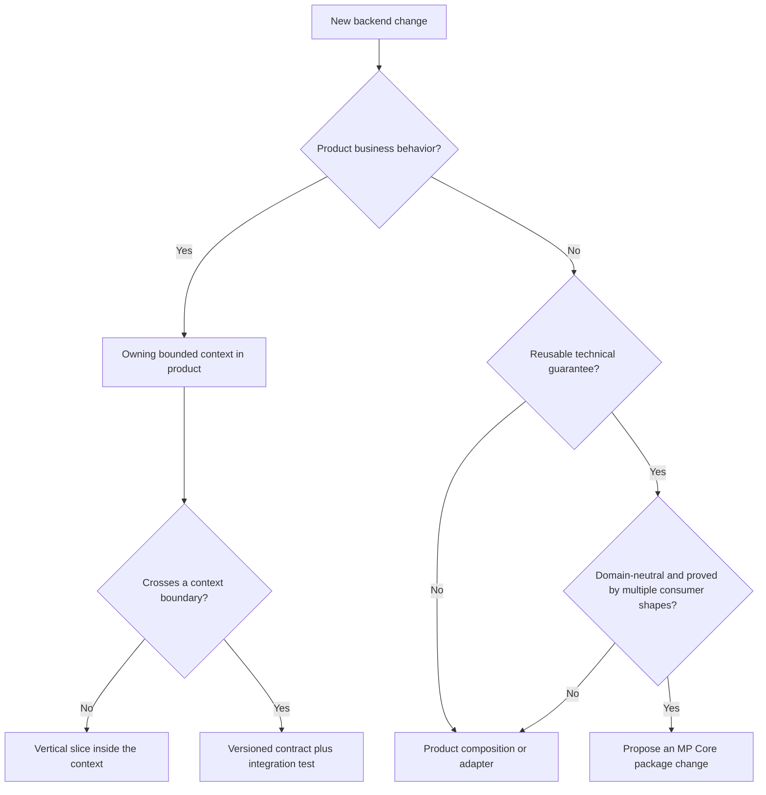

# Backend engineering conventions

This document is the default decision contract for product developers, reviewers, and coding agents that
build with MP Core. It standardizes placement, separation of concerns, and the path from an approved
requirement to a verified vertical slice.

It does not authorize an agent to invent a bounded context, business rule, permission, integration, or
contract. When one of those decisions is missing, stop at the decision gate.

## First decide which repository owns the change



| Destination | Put it here when | Never put here |
|---|---|---|
| Product bounded context | The context owns the language, invariant, state, and use case | Another context's data model or provider-specific types |
| Product composition | Host startup, endpoint mapping, policies, queues/topics, and environment wiring are product decisions | Domain invariants or persistence algorithms |
| Product infrastructure adapter | A database, broker, remote service, object store, identity administration, or clock implements a product-owned port | Business policy or transport response shaping |
| Versioned contract | Two independently deployable contexts or an external consumer must agree | Shared domain assemblies between services |
| MP Core foundation | A domain-neutral technical guarantee has a stable public API, compatibility evidence, and more than one consumer shape | Product roles, workflow states, endpoints, tables, messages, or service names |

A sample that exposes a framework defect fixes the defect in MP Core. A product requirement stays in the
product. Similar-looking code is not enough evidence for a framework abstraction.

## Separation of concerns inside a bounded context

Dependencies point inward: `Api -> Infrastructure -> Application -> Domain`, with Application depending
on infrastructure only through ports. Exact project references may be narrower, never broader.

| Layer | Owns | Must not own |
|---|---|---|
| Domain | Aggregates, value objects, state transitions, invariants, domain events, and stable business vocabulary | HTTP/gRPC, EF Core, brokers, identity-provider types, configuration |
| Application | Commands, queries, handlers, ports, orchestration, expected failures, authorization against the current actor, and transaction intent | Provider SDKs, schema mappings, HTTP results, UI concerns |
| Infrastructure | Port implementations, persistence mappings, migrations, remote clients, broker/store adapters | Business decisions or endpoint policy |
| API/host | REST/gRPC mapping, authentication/authorization policies, health, observability, and explicit route/channel composition | Aggregate mutation, provider business logic, cross-service database reads |

### Where a rule belongs

- If invalid state must be impossible regardless of caller, the aggregate or value object owns the rule.
- If the decision coordinates actors, ports, or more than one aggregate, the application handler owns the
  orchestration while each aggregate still protects its own state.
- If the decision is about HTTP status, protobuf mapping, headers, or route shape, the transport adapter
  owns it.
- If the decision is about SQL, a provider SDK, serialization, or retrying an external call, an
  infrastructure adapter owns it behind an application port.
- If two services need the same fact, exchange a versioned message or call contract; never read the other
  service's database and never create a shared domain assembly.

Validation rejects malformed input. It does not replace a domain invariant. Authorization at the host
protects an operation; record-level authority in the handler protects the specific resource. Both may be
required.

## Standard vertical-slice path


1. **State the behavior with examples.** Include at least one success, one refusal, actor, tenant, and the
   observable result. Ambiguous acceptance criteria are not ready for implementation.
2. **Name the owner.** Confirm the bounded context and aggregate. A cross-context change also needs an
   approved context-map relationship.
3. **Define what crosses the boundary.** Specify REST/gRPC operation or versioned message, compatibility,
   stable failure identities, authorization, idempotency, and timeout behavior.
4. **Implement inward-out.** Add the domain rule and transition, then the application command/query,
   handler, ports, adapters, and finally host mapping.
5. **Keep one transaction boundary.** A command's state change, outbox messages, idempotency record, and
   audit intent commit together where the selected capability requires them.
6. **Treat integration as failure-prone.** Timeouts, bounded retries, circuit behavior, dead-letter policy,
   and idempotent consumers are explicit. Never add a catch-all broker route.
7. **Test each ownership boundary.** Domain tests prove invariants; handler tests prove orchestration and
   expected failures; integration tests prove adapters and transactional guarantees; contract tests prove
   independently declared copies; architecture tests prove dependency direction.
8. **Run the connected scenario.** Source tests do not prove routing, identity, broker, database, or
   gateway behavior. Exercise the slice through the repository's documented runtime and report the exact
   evidence.

## A small slice shape

```csharp
public sealed record CancelOrder(Guid OrderId, string? Note)
    : ICommand<Result<OrderView>>;

public static class CancelOrderHandler
{
    public static async Task<Result<OrderView>> Handle(
        CancelOrder command,
        ICurrentActorAccessor actor,
        IOrderRepository orders,
        IUnitOfWork unitOfWork,
        CancellationToken cancellationToken)
    {
        var order = await orders.FindAsync(command.OrderId, cancellationToken);
        if (order is null || !order.IsVisibleTo(actor.Current))
            return Result<OrderView>.FromFailure(OrderFailures.NotFound());

        order.Cancel(command.Note); // The aggregate enforces valid state transitions.
        return Result<OrderView>.Success(OrderViews.Of(order));
    }
}
```

The handler coordinates identity, loading, and the use case. The aggregate owns whether its state can
change. The repository implementation and endpoint mapping remain outside both. The actual product must
define its own failure identities and authority rules; this shape is not a product requirement.

## Contracts, generation, and shared code

| Situation | Required boundary |
|---|---|
| REST consumer | Versioned OpenAPI operation with exact success and failure semantics |
| gRPC consumer | Proto-first service and message contract with compatibility review |
| Async integration | Versioned event/command, explicit route, idempotent consumer, retry and dead-letter policy |
| Two services describe one contract | Each service declares its own copy; consumer-driven contract tests hold them together |
| Generated scaffold or client is wrong | Fix the generator/template or owning contract and add a failing regression; do not patch generated output |
| Two contexts share a concept | Translate through an anti-corruption layer; do not share aggregates or persistence models |

## Verification ladder

Run the narrowest useful test first, then expand. A normal product slice should produce evidence for:

1. domain invariant and negative case;
2. handler success, expected failures, authorization, tenant isolation, and cancellation;
3. endpoint or message contract;
4. adapter integration against its real dependency where a guarantee depends on that dependency;
5. architecture and contract suites;
6. Release build with warnings treated as errors;
7. repository-wide tests; and
8. the focused and then complete connected scenario when the slice crosses runtime boundaries.

Use the consumer repository's commands. For a generated MP Core backend they are documented in that
backend's `docs/development-workflow.md`, `docs/getting-started.md`, and root running guide.

## Review checklist for developers and agents

- [ ] Approved behavior, examples, owner, and actor are explicit.
- [ ] The bounded context and aggregate own the vocabulary and invariant.
- [ ] Domain has no provider, transport, host, or framework-composition dependency.
- [ ] Application orchestrates through ports and returns expected failures explicitly.
- [ ] Infrastructure contains provider details without deciding business policy.
- [ ] Host composition exposes only the approved transport and authorization policy.
- [ ] Tenant and actor come from validated context, not caller-controlled business input.
- [ ] State, outbox, idempotency, and audit boundaries are consistent with the use case.
- [ ] External calls have explicit timeout, retry, cancellation, and sensitive-data behavior.
- [ ] Cross-context communication uses a versioned contract; no database or domain assembly is shared.
- [ ] No generated file or published package version was overwritten.
- [ ] Tests cover refusal and failure behavior, not only success.
- [ ] Connected evidence is reported without turning a local pass into a production claim.

An agent must pause when the context boundary, rule, permission, contract, data ownership, or failure
policy is not approved. It must not complete the design by guessing.

## Sources and why they apply

| Source | Convention used here |
|---|---|
| Eric Evans, *Domain-Driven Design* (2003) | Bounded contexts, aggregates, ubiquitous language, and anti-corruption layers |
| Robert C. Martin, *Clean Architecture* (2017) | Dependency direction and separation of policy from mechanisms |
| Alistair Cockburn, [Hexagonal Architecture](https://alistair.cockburn.us/hexagonal-architecture/) | Application ports and infrastructure adapters |
| Martin Fowler, [Presentation Domain Data Layering](https://martinfowler.com/bliki/PresentationDomainDataLayering.html) | Explicit separation of transport, domain behavior, and data access |
| Gregor Hohpe and Bobby Woolf, *Enterprise Integration Patterns* (2003) | Explicit message contracts, channels, and integration boundaries |
| Sam Newman, *Building Microservices*, second edition (2021) | Independently owned service boundaries and compatibility |
| MP Core [ADR-011](decisions/ADR-011-application-execution-model.EN.md) and [ADR-012](decisions/ADR-012-module-layout-business-rules-and-messages.EN.md) | Execution model, module layout, business rules, and message ownership |

