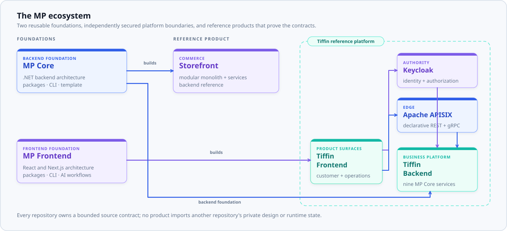
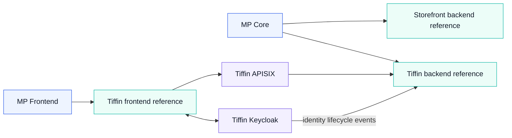

# MP ecosystem

The MP ecosystem separates reusable architecture from product examples and integration overlays. Each
repository owns a bounded source contract and can be tested without importing another repository's
private runtime state or design source.

<picture>
  <source media="(prefers-color-scheme: dark)" srcset="../images/ecosystem-dark.svg">
  <source media="(prefers-color-scheme: light)" srcset="../images/ecosystem-light.svg">
  
</picture>

## Repository relationships

| Repository | Owns | Does not own |
|---|---|---|
| [`mpcore`](https://github.com/panahister/mpcore) | .NET runtime packages, CLI, templates, backend skills | Product behavior |
| [`mpfrontend`](https://github.com/panahister/mpfrontend) | Frontend packages, CLI, contract tooling, bounded AI workflows | Consumer branding or private design files |
| [`mpcore-storefront-sample`](https://github.com/panahister/mpcore-storefront-sample) | Commerce backend reference and its business rules | Reusable framework behavior |
| [`mpcore-tiffin-sample`](https://github.com/panahister/mpcore-tiffin-sample) | Food-delivery backend reference and nine service boundaries | Identity credentials or edge route ownership |
| [`mpfrontend-tiffin-reference`](https://github.com/panahister/mpfrontend-tiffin-reference) | Customer and operations product surfaces | Backend authorization or credentials |
| [`tiffin-keycloak`](https://github.com/panahister/tiffin-keycloak) | Identity, credentials, authorization seed, lifecycle-event provider, authentication theme | Product business records |
| [`tiffin-apisix`](https://github.com/panahister/tiffin-apisix) | Declarative public edge, TLS termination, correlation, routing, optional token pre-validation | Service authorization decisions |

## Visual language

The public repositories use one cool-spectrum visual family: deep navy foundations, indigo for reusable
platform capability, cyan for flow and connectivity, teal for product outcomes, and violet for identity
or extension boundaries. Yellow is intentionally absent from the MP public brand. Product screenshots
may show a consumer's own theme, but repository artwork and architectural diagrams follow this shared
system.

Architecture artwork is repository-native SVG with light and dark variants. It remains readable in a
Git diff, uses no external image host, and can be regenerated from the scripts stored with each
repository. Mermaid is used for relationships that benefit from a compact, reviewable source form.
